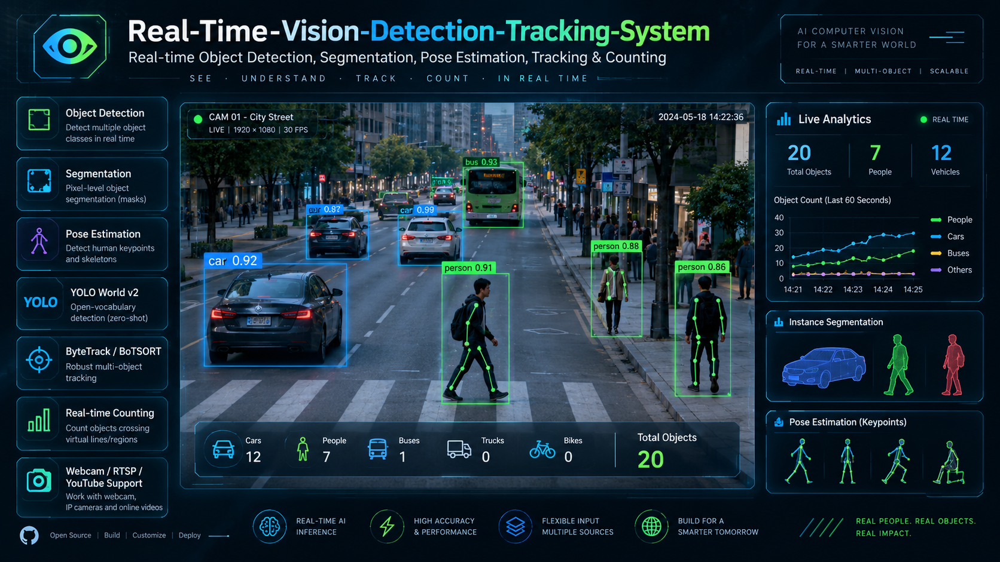
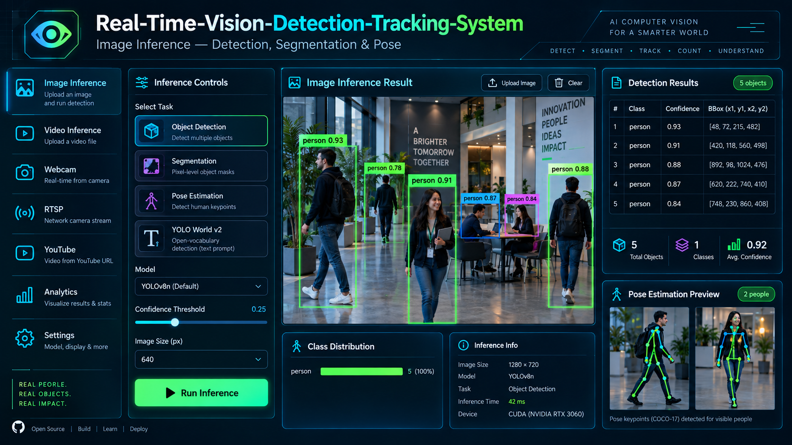
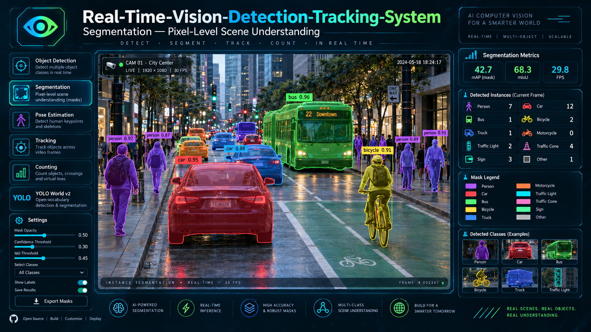
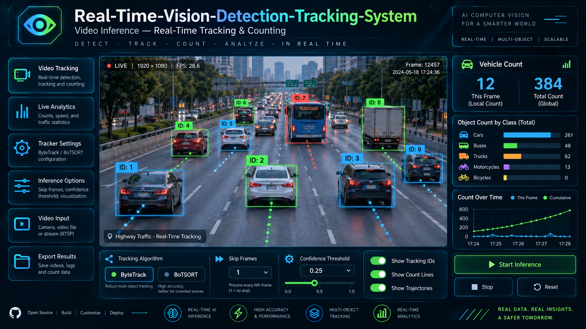
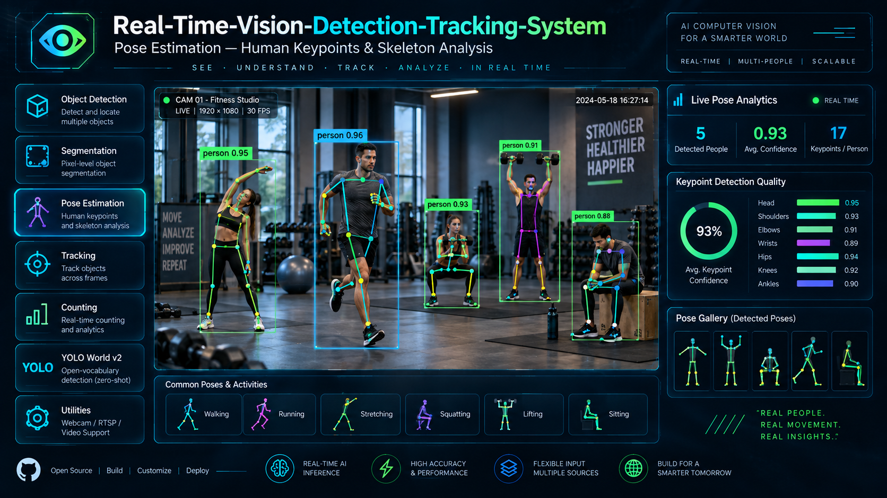
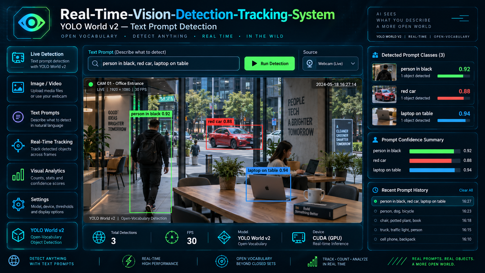
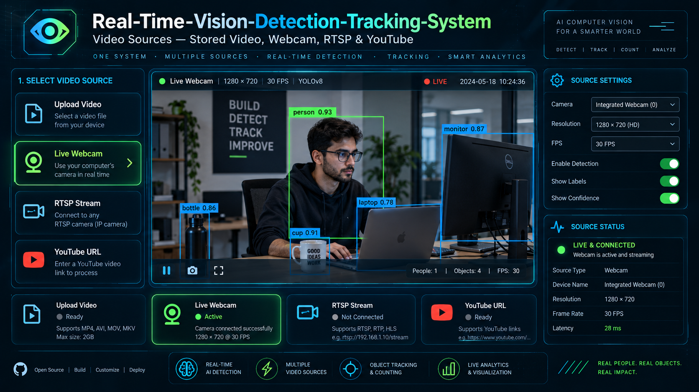
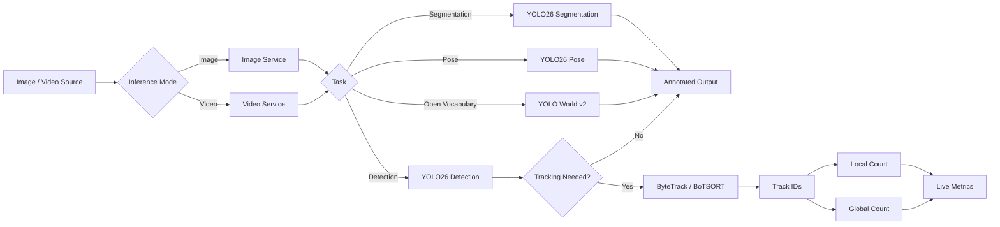

<p align="center">
  
</p>

<h1 align="center">Real-Time-Vision-Detection-Tracking-System</h1>

<p align="center">
  <strong>Real-time object detection, segmentation, pose estimation, open-vocabulary search, multi-object tracking, and counting across images and live video streams.</strong>
</p>

<p align="center">
  
  
  
  
  
  
</p>

<p align="center">
  <a href="#-one-line-idea">One-line idea</a> •
  <a href="#-product-preview">Preview</a> •
  <a href="#-what-makes-it-different">Why this project</a> •
  <a href="#-core-pipeline">Pipeline</a> •
  <a href="#-project-structure">Structure</a> •
  <a href="#-quick-start">Quick Start</a>
</p>

---

## ✦ One-line idea

> **Real-Time-Vision-Detection-Tracking-System turns raw images and video streams into usable visual intelligence through detection, segmentation, pose estimation, open-vocabulary prompts, tracking, and counting.**

A small demo usually stops here:

```text
IMAGE / FRAME
     ↓
DETECTION
     ↓
BOUNDING BOX
```

This project goes further:

```text
IMAGE / VIDEO / WEBCAM / RTSP / YOUTUBE
                    ↓
               YOLO INFERENCE
                    ↓
      DETECTION / SEGMENTATION / POSE
                    ↓
              YOLO WORLD v2
                    ↓
         BYTETRACK / BOTSORT IDs
                    ↓
          LOCAL + GLOBAL COUNTING
                    ↓
             LIVE METRICS / UI
```

---

# ✨ Product Preview

> [!NOTE]
> The visuals below are standalone project images created for this repository. They are individual images, not cropped collage pieces.

## 1. Project Overview

<p align="center">
  
</p>

A high-level product view of the full system: detection, segmentation, pose estimation, tracking, counting, and live analytics in one interface.

---

<table>
<tr>
<td width="50%" valign="top">

### 2. Image Inference



Run image-based object detection, segmentation, pose estimation, and result inspection from a clean inference interface.

</td>
<td width="50%" valign="top">

### 3. YOLO World v2 — Text Prompt Detection



Detect objects from natural-language prompts such as `person in black`, `red car`, or `laptop on table`.

</td>
</tr>
<tr>
<td width="50%" valign="top">

### 4. Video Tracking & Counting



Track vehicles and moving objects with persistent IDs, local counts, total counts, and time-based analytics.

</td>
<td width="50%" valign="top">

### 5. Pose Estimation



Analyze human body keypoints and skeletons in real time for sports, movement, and posture-oriented scenarios.

</td>
</tr>
<tr>
<td width="50%" valign="top">

### 6. Segmentation



Go beyond boxes with pixel-level masks for richer scene understanding across urban or dynamic environments.

</td>
<td width="50%" valign="top">

### 7. Multi-Source Video Support



Use uploaded videos, webcam feeds, RTSP streams, and YouTube links from one dashboard.

</td>
</tr>
</table>

---

# 🧠 What Makes It Different

<table>
<tr>
<td width="25%" align="center">
<h3>01</h3>
<b>Multi-Task Vision</b><br/>
Detection, segmentation, pose estimation, and open-vocabulary search.
</td>
<td width="25%" align="center">
<h3>02</h3>
<b>Real Tracking</b><br/>
ByteTrack and BoTSORT maintain object identity across frames.
</td>
<td width="25%" align="center">
<h3>03</h3>
<b>Multiple Inputs</b><br/>
Images, stored video, live webcam, RTSP streams, and YouTube URLs.
</td>
<td width="25%" align="center">
<h3>04</h3>
<b>Live Counting</b><br/>
Current-frame counts, cumulative counts, FPS, and class analytics.
</td>
</tr>
</table>

---

# 🏗 Core Pipeline



---

# 🔥 Core Features

## 1. Object Detection
- Detect multiple objects in real time.
- Class labels and confidence scores.
- Suitable for image and video modes.

## 2. Instance Segmentation
- Pixel-level masks.
- Better scene understanding than only boxes.
- Useful for object shape awareness.

## 3. Pose Estimation
- Human keypoint detection.
- Skeleton overlays.
- Supports posture and movement analysis.

## 4. YOLO World v2
- Open-vocabulary text-prompt detection.
- Detect items described in natural language.
- Flexible beyond closed class lists.

## 5. Video Tracking
- ByteTrack and BoTSORT support.
- Stable object IDs across frames.
- Good for object flow and temporal analysis.

## 6. Counting
- Local count = current frame.
- Global count = unique tracked objects across the video.
- Useful for traffic and movement monitoring.

## 7. Multi-Source Input
- Stored video files.
- Webcam.
- RTSP stream.
- YouTube URL.

## 8. Performance Controls
- Confidence threshold.
- IoU threshold.
- Skip-frame processing.
- Cached model loading.

---

# 📁 Project Structure

```text
Real-Time-Vision-Detection-Tracking-System/
│
├── app.py
├── config.py
├── model_loader.py
├── image_service.py
├── video_service.py
├── requirements.txt
├── packages.txt
├── README.md
│
├── assets/
│   ├── 01_hero_overview.png
│   ├── 02_image_inference.png
│   ├── 03_yolo_world_v2.png
│   ├── 04_video_tracking_counting.png
│   ├── 05_pose_estimation.png
│   ├── 06_segmentation.png
│   └── 07_multi_source_video.png
│
├── images/
├── videos/
└── weights/
```

---

# 🧩 Module Responsibilities

| Module | Responsibility |
|---|---|
| `app.py` | Streamlit page setup, routing, and sidebar controls |
| `config.py` | Centralized model names, paths, defaults, and UI values |
| `model_loader.py` | Model loading and caching |
| `image_service.py` | Image inference workflows |
| `video_service.py` | Video sources, tracking, counting, and live metrics |

---

# ⚡ Quick Start

## 1. Clone

```bash
git clone <your-repository-url>
cd Real-Time-Vision-Detection-Tracking-System
```

## 2. Create a virtual environment

```bash
python -m venv .venv
```

### Windows

```bash
.venv\Scriptsctivate
```

### Linux / macOS

```bash
source .venv/bin/activate
```

## 3. Install dependencies

```bash
pip install -r requirements.txt
```

---

# 🎯 Supported Models

| Task | Default Model |
|---|---|
| Object Detection | `yolo26n.pt` |
| Segmentation | `yolo26n-seg.pt` |
| Pose Estimation | `yolo26n-pose.pt` |
| Open-Vocabulary Detection | `yolov8l-worldv2.pt` |

---

# ▶ Run the App

```bash
streamlit run app.py
```

Open in browser:

```text
http://localhost:8501
```

---

# 🎬 Video Inference Flow

```text
Select Source
     ↓
Choose Task
     ↓
Enable Tracking
     ↓
Select ByteTrack / BoTSORT
     ↓
Adjust Threshold / Skip Frames
     ↓
Run Inference
     ↓
View IDs + Counts + FPS + Output
```

---

# 🗺 Roadmap

<details open>
<summary><b>Current Core</b></summary>

- [x] Object detection
- [x] Segmentation
- [x] Pose estimation
- [x] YOLO World v2 text-prompt detection
- [x] ByteTrack integration
- [x] BoTSORT integration
- [x] Local counting
- [x] Global counting
- [x] Stored video support
- [x] Webcam support
- [x] RTSP support
- [x] YouTube URL support
- [x] Streamlit interface

</details>

<details>
<summary><b>Future Improvements</b></summary>

- [ ] Export results to CSV / JSON
- [ ] Region-of-interest counting
- [ ] Multi-camera dashboard
- [ ] Benchmarking page
- [ ] More model backends
- [ ] Extended analytics

</details>

---

# 💡 Why This Is More Than a Basic YOLO Demo

| Basic Demo | Real-Time-Vision-Detection-Tracking-System |
|---|---|
| Only detection | Detection + segmentation + pose |
| Fixed labels | Open-vocabulary prompt detection |
| Single image use | Image + webcam + video + RTSP + YouTube |
| No ID continuity | Persistent object tracking |
| Frame count only | Local + cumulative counting |
| Minimal UI | Complete interactive dashboard |

---

# 🧰 Technology Stack

| Layer | Technology |
|---|---|
| Language | Python |
| UI | Streamlit |
| Vision Models | YOLO26 |
| Open-Vocabulary | YOLO World v2 |
| Tracking | ByteTrack / BoTSORT |
| Video Processing | OpenCV |
| Webcam | streamlit-webrtc |
| Deployment | Streamlit Community Cloud |

---

# 🧭 Project Philosophy

> **Detection shows what is present. Tracking and context show what is happening.**

This project combines:

```text
detection
+ segmentation
+ pose
+ open-vocabulary prompts
+ tracking
+ counting
+ multiple sources
+ live metrics
```

into one practical computer-vision workflow.

---

# ⚠️ Project Note

This repository is best suited for educational, research, demo, and prototyping use. For deployment on real workloads, performance should be validated against your model size, hardware, input resolution, and target video sources.

---

# 🤝 Contributing

Contributions, fixes, and improvements are welcome.

```bash
git checkout -b feature/your-feature
git add .
git commit -m "Add feature"
git push origin feature/your-feature
```

Then open a Pull Request.

---

<p align="center">
  <strong>Real-Time-Vision-Detection-Tracking-System</strong><br/>
  <sub>Detect → Segment → Track → Count → Understand</sub>
</p>
 
---
 
## 👨‍💻 Developer
 
<table>
  <tr>
    <td width="150" align="center">
      <br>
      <strong>Asad Ali</strong>
    </td>
    <td>
      <strong>AI, Blockchain & Software Engineer</strong><br><br>
      🐙 GitHub: <a href="https://github.com/AsadAliEng">@AsadAliEng</a><br>
      📧 Email: <a href="mailto:asadali.cryptoeng@gmail.com">asadali.cryptoeng@gmail.com</a><br>
      🚀 Focus: intelligent systems, applied machine learning, AI security, Web3 products, automation, and production-oriented engineering
    </td>
  </tr>
</table>

